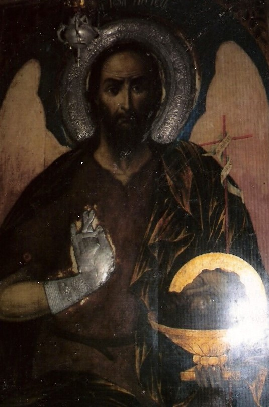
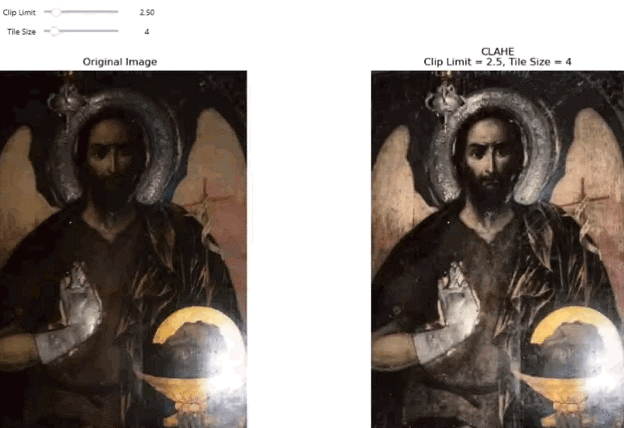
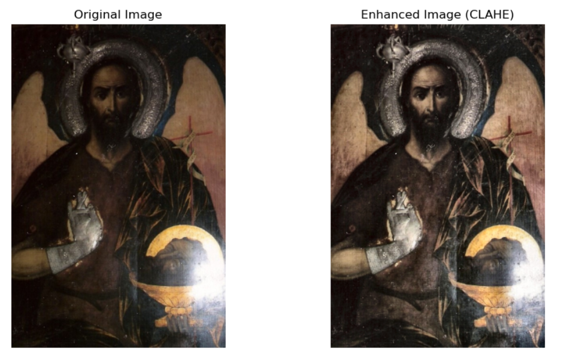

# 🖼 Interactive CLAHE Enhancement of an Orthodox Icon

### Computer Vision • Digital Art History • OpenCV • Jupyter Notebook

---

> An interactive Jupyter Notebook demonstrating the application of **Contrast Limited Adaptive Histogram Equalization (CLAHE)** to an Orthodox icon while preserving its original colours.
>
> This project combines **Computer Vision**, **Digital Art History**, and **interactive visualization** to provide an educational workflow for image enhancement and analysis.

---

## Preview

<p align="center">



</p>

---

## Project Overview

This repository presents an interactive Jupyter Notebook that demonstrates how **Contrast Limited Adaptive Histogram Equalization (CLAHE)** can improve the visibility of details in an Orthodox icon without altering its original colour appearance.

Unlike traditional image enhancement demonstrations that often use generic photographs, this notebook applies Computer Vision techniques to a documented nineteenth-century Orthodox icon photographed by the author during doctoral research.

The notebook combines theoretical explanations, practical implementation, interactive parameter exploration, and visual interpretation, making it suitable both as an educational resource and as an introduction to the application of Computer Vision methods in Digital Art History.

---

## Main Features

✔ Interactive Jupyter Notebook

✔ Image upload from the local computer

✔ LAB colour space conversion

✔ Channel separation

✔ CLAHE enhancement

✔ Image reconstruction

✔ Histogram analysis

✔ Comparative histogram visualization

✔ Interactive parameter tuning

✔ Art historical observations

✔ Educational explanations throughout the workflow

---

## Workflow

```text
                Upload Image
                      │
                      ▼
          Image Properties Inspection
                      │
                      ▼
            LAB Colour Space Conversion
                      │
                      ▼
             Channel Separation (L A B)
                      │
                      ▼
          CLAHE Enhancement of L Channel
                      │
                      ▼
            Image Reconstruction (LAB → RGB)
                      │
                      ▼
               Histogram Analysis
                      │
                      ▼
      Interactive Parameter Exploration
                      │
                      ▼
 Discussion • Conclusion • References
```

---

## Interactive Demonstration

The notebook allows users to modify the two most important CLAHE parameters interactively:

- Clip Limit
- Tile Grid Size

The enhanced image is updated immediately, allowing direct comparison with the original image.

*(GIF demonstration will be added here.)*

```
<p align="center">



</p>
``

```
## Repository Structure

```text
.
├── images/
│   ├── icon.jpg
│   ├── before_after.png
│   └── clahe_demo.gif
├── Interactive_CLAHE_Orthodox_Icon.ipynb
├── requirements.txt
├── LICENSE
└── README.md
```

---

## Study Image

The notebook uses a nineteenth-century Orthodox icon as a case study.

| Property             | Description                                   |
| -------------------- | --------------------------------------------- |
| **Title**            | *Saint John the Baptist*                      |
| **Artist**           | Ivan Dospevski                                |
| **Year**             | 1867                                          |
| **Dimensions**       | 122 × 83 cm                                   |
| **Current Location** | Church of St. Demetrius, Kyustendil, Bulgaria |

The photograph used in this project was taken by the author during doctoral research in Art History.

Permission to photograph the icon was granted by the local representatives of the Bulgarian Orthodox Church.

The image is included exclusively for educational and scientific purposes.

---

## Notebook Contents

The notebook is organised into the following chapters:

| Chapter | Description                             |
| ------- | --------------------------------------- |
| 1       | Introduction                            |
| 2       | Import Libraries                        |
| 3       | Study Image                             |
| 4       | Upload Image                            |
| 5       | Image Properties                        |
| 6       | LAB Colour Space                        |
| 7       | Channel Separation                      |
| 8       | CLAHE Enhancement                       |
| 9       | Image Reconstruction                    |
| 10      | Histogram Analysis and Comparison       |
| 11      | Interactive CLAHE Parameter Exploration |
| 12      | Discussion                              |
| 13      | Conclusion and Future Work              |
| 14      | References                              |

---

## Installation

Clone the repository:

```bash
git clone https://github.com/YOUR_USERNAME/YOUR_REPOSITORY.git
```

Move into the project folder:

```bash
cd YOUR_REPOSITORY
```

Install the required libraries:

```bash
pip install -r requirements.txt
```

Launch Jupyter Notebook:

```bash
jupyter notebook
```

Open:

```text
Interactive_CLAHE_Orthodox_Icon.ipynb
```

---

## Requirements

The notebook was developed using Python 3 and requires the following packages:

```text
opencv-python
numpy
matplotlib
ipywidgets
jupyter
```

You can install all dependencies with:

```bash
pip install -r requirements.txt
```

---

## Educational Objectives

This notebook is intended to demonstrate:

* image enhancement using CLAHE;
* processing images in the LAB colour space;
* histogram analysis;
* interactive parameter exploration with ipywidgets;
* practical applications of Computer Vision in Digital Art History.

Although the project is introductory, the workflow reflects methods commonly used in digital image analysis and can serve as a starting point for more advanced research in cultural heritage imaging.


---

## Results

The application of CLAHE significantly improves the local visibility of details while preserving the original colour relationships of the icon.

The enhancement is particularly noticeable in:

* inscriptions;
* facial modelling;
* garments and folds;
* halos;
* decorative elements;
* local contrast in darker regions.

The comparison below illustrates the visual improvement achieved by applying CLAHE to the Lightness channel in the LAB colour space.

<p align="center">



</p>

---

## Technologies

* Python
* OpenCV
* NumPy
* Matplotlib
* Jupyter Notebook
* ipywidgets

---

## Applications

Although developed as an educational project, the presented workflow can be applied in several domains:

* Digital Art History
* Cultural Heritage Documentation
* Museum Studies
* Digital Humanities
* Image Processing Education
* Computer Vision Teaching

---

## Citation

If you use this repository in academic work, please cite it as:

```text
Desislava S. Georgieva.

Interactive CLAHE Enhancement of an Orthodox Icon:
A Jupyter Notebook for Computer Vision and Digital Art History.

GitHub Repository.

Zenodo DOI: (to be added after publication)
```

---

## License

This project is released under the MIT License.

The notebook source code may be reused according to the terms of the license.

The study photograph remains the intellectual property of the author.

---

## Acknowledgements

The author gratefully acknowledges the permission granted by the local representatives of the Bulgarian Orthodox Church for photographing the icon used in this notebook.

This notebook was developed as part of the author's continuing research in Digital Art History and Computer Vision.

---

## About the Author

**Desislava S. Georgieva**

PhD in Art History

Research interests:

* Digital Art History
* Computer Vision
* Machine Learning
* Image Analysis
* Orthodox Iconography
* Cultural Heritage

GitHub: *(add your profile link)*

Zenodo: *(add your profile link after publication)*

---

## Future Development

This notebook represents the first step in a broader research initiative exploring the application of Computer Vision techniques to Orthodox iconography and cultural heritage.

Future projects will investigate additional image processing and analysis methods, including edge detection, colour analysis, texture analysis, feature extraction, and machine learning approaches for the study of artworks.

---

<p align="center">

### ⭐ If you found this project interesting, consider giving it a star!

Thank you for visiting this repository.

</p>

